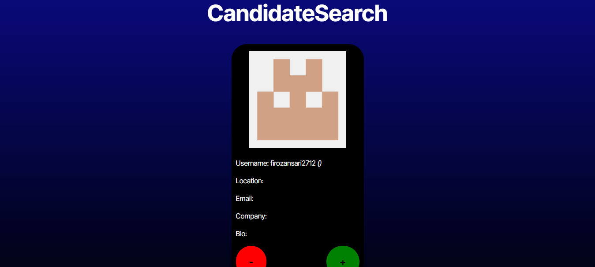

# ReactPortfolio

## Description

This react application allows the user to pull programmers using Github's API. If the user finds a profile they like, then they can save that profile to a list for later viewing. They can also remove saved candidates from that list. That way, looking for potential candidates for your job openings is easier to manage.

## Table of Contents

[1. Installation](#1-installation)
[2. Usage](#2-usage)
[3. License](#3-license)
[4. Contributing](#4-contributing)
[5. Tests](#5-tests)
[6. Questions](#6-questions)

## 1. Installation

You can download the repo here: https://github.com/this-is-yosuke/13_CandidatesNow.

## 2. Usage

This application uses React.js and Vite. You can find a deployed version of the app here:https://one3-candidatesnow.onrender.com/. This screenshot shows the app's appearance: 

## 3. License

    This project is licensed under the The Unlicense license.

* [License](#License)

## 4. Contributing

Clone the repo and make a pull request.

## 5. Tests

None

## 6. Questions

You can see my work at:
https://github.com/this-is-yosuke

You can reach me at my email:
